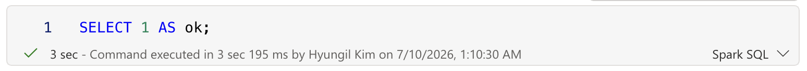

# Track1 실습 준비물 상세 설명

이 문서는 트랙1(FabricIQ 시맨틱 레이어) 실습 준비물을 상세히 설명합니다.  
Track 2/3 준비물은 아래 별도 문서를 참조하세요.

- Track 2: [PREREQUISITES.md](../track2/PREREQUISITES.md)
- Track 3: [PREREQUISITES.md](../track3/PREREQUISITES.md)

> Track1 종료 시에는 Track2 시작을 위해 [WORKBOOK.md](WORKBOOK.md)의 **Track2 인계 패키지**를 반드시 작성합니다.

## 1. Fabric Workspace 접근 권한

### 무엇을 준비해야 하나요?
- 트랙1 실습을 진행할 **Microsoft Fabric Workspace**에 접속 가능한 계정
- 최소한 다음 작업이 가능한 권한
  - Workspace 열람
  - Lakehouse 생성/열기
  - Notebook 생성/실행
  - 테이블 조회 및 SQL 실행
- **Fabric Ontology(Preview) 활성화 상태**
  - 테넌트에서 Preview 기능이 켜져 있고, 해당 워크스페이스가 지원 리전(예: Ontology Preview가 활성화된 리전)에 속해 있어야 합니다.
  - Preview 상태는 변경될 수 있으므로 워크숍 D-3일에 최종 확인 필요.

### 왜 필요한가요?
- 실습 전 과정(데이터 확인, 프로파일링, 매핑, 검증)이 Workspace 내부에서 수행됩니다.
- 권한이 없으면 Lakehouse/Notebook가 보이지 않거나 쿼리 실행이 차단됩니다.
- Preview 기능이 꺼져 있으면 Ontology 모델링 단계 실습 자체가 불가합니다.

### Fabric에서 만드는 방법 (단계별)
1. **Fabric 포털 접속**
   - https://app.fabric.microsoft.com 접속 후 워크숍 계정으로 로그인
2. **Workspace 생성(또는 기존 Workspace 사용)**
   - 좌측 `Workspaces` > `+ New workspace`
   - 이름 예시: `workshop-track1-teamA`
   - 라이선스/용량이 할당된 워크스페이스인지 확인

   > 💡 **Ontology 관점 참고 — 무엇이 진짜 중요한가**
   > Ontology 실습/구성에서는 **저장 형식(semantic model storage format)보다 다음 조건이 더 중요**합니다.
   > 1. **Fabric capacity 연결**: workspace가 Fabric capacity에 연결되어 있어야 함
   > 2. **Tenant setting 허용**: Fabric/AI 관련 tenant setting이 허용되어 있어야 함
   > 3. **권한**: 사용자에게 workspace **Contributor 이상** 권한이 있어야 함
   >
   > 따라서 온톨로지 실습/구성 목적이라면 **Small semantic model storage format으로 시작해도 무방**합니다. 저장 형식보다 위 3가지 조건 충족 여부를 먼저 확인하세요.
3. **권한 부여**
   - Workspace 우측 상단 `Manage access`
   - 실습 참가자에게 최소 `Contributor` 권한 부여
4. **Ontology(Preview) 활성 여부 확인**
   - Workspace 내 `New item` 목록 또는 Data/AI 관련 메뉴에서 Ontology(Preview) 항목 노출 확인
   - 항목이 보이지 않으면 테넌트/리전/용량 설정을 운영 담당자가 재확인
5. **기본 연결 테스트**
   - 이후 생성할 Lakehouse SQL endpoint 또는 Notebook에서 `SELECT 1` 실행으로 권한 확인

### 사전 점검 체크리스트
- [ ] Fabric 포털 로그인 가능
- [ ] 지정된 Workspace가 목록에 보임
- [ ] Workspace 안에서 Lakehouse/Notebook 항목 접근 가능
- [ ] SQL Endpoint 또는 Notebook에서 간단한 `SELECT 1` 실행 가능
- [ ] Fabric Ontology(Preview) 기능이 테넌트/워크스페이스에서 활성화됨
- [ ] 워크스페이스 리전이 Ontology Preview 지원 리전인지 확인

### 자주 발생하는 문제
- **Workspace가 안 보임**: 권한 미부여 또는 다른 테넌트 로그인 가능성
- **읽기만 가능**: Viewer 권한만 있는 상태일 수 있음
- **쿼리 실행 실패**: 연결 대상 Lakehouse 미선택 또는 세션 미초기화

---

## 2. Lakehouse 및 Notebook

### Lakehouse
- 실습 데이터(샘플 테이블)가 저장되는 기본 데이터 저장/분석 공간입니다.
- 테이블 구조 확인, SQL 기반 검증, 결과 저장의 중심 역할을 합니다.

### Notebook
- SQL 또는 코드(Python/Spark 등)를 실행해 프로파일링/검증을 수행하는 실행 환경입니다.
- 실습에서는 주로 다음 목적에 사용합니다.
  1. 데이터 품질 점검 쿼리 실행
  2. 결과 캡처(쿼리 결과 테이블/스크린샷)
  3. 이슈 분석 메모 정리

### 권장 구성
- Lakehouse 1개 + Notebook 1개를 팀 기준 기본 세트로 사용
- Notebook 섹션을 미션별로 분리
  - `Mission2_Profiling`
  - `Mission3_StandardSchema`
  - `Mission5_Validation`

### Fabric에서 만드는 방법 (단계별)
1. **Lakehouse 생성**
   - Workspace > `+ New item` > `Lakehouse`
   - 이름 예시: `lh_track1_teamA`
   - 생성 후 `Files`/`Tables` 탭이 보이는지 확인

   > 💡 **Lakehouse를 만들면 SQL analytics endpoint가 함께 생성됩니다**
   > Fabric에서 Lakehouse를 만들면 보통 **Lakehouse item**과 **SQL analytics endpoint**가 같은 이름으로 함께 생성됩니다.
   >
   > | 이름 | Type | 의미 |
   > |---|---|---|
   > | `lh_track1_teamA` | Lakehouse | OneLake/Delta 테이블을 저장·관리하는 Lakehouse |
   > | `lh_track1_teamA` | SQL analytics endpoint | Lakehouse 테이블을 SQL로 조회하기 위한 자동 생성 endpoint |
   >
   > SQL analytics endpoint는 별도로 만든 "중복 Lakehouse"가 아니라, Lakehouse에 딸린 **읽기/분석용 SQL 인터페이스**입니다(Power BI, SQL 쿼리, Direct Lake/semantic model 연결 등에 사용).
   > 따라서 삭제하거나 따로 관리할 필요는 없으며, Lakehouse를 만들면 같이 보이는 것이 Fabric의 기본 동작입니다.
2. **Notebook 생성**
   - Workspace > `+ New item` > `Notebook`
   - 이름 예시: `nb_track1_teamA`
3. **Notebook 설정(커널/언어) 확인**
   - 노트북 상단 언어 드롭다운에서 기본 커널을 `PySpark (Python)`으로 설정
   - SQL 검증 셀을 자주 사용할 경우 셀 단위로 `Spark SQL`로 전환해 실행
   - `T-SQL`은 Track1 기본 경로에서는 사용하지 않음(별도 SQL Endpoint 중심 시나리오에서 사용)
4. **Notebook에 Lakehouse 연결**
   - Notebook 좌측 탐색기에서 `Add data items` 클릭 → **Existing lakehouse** 선택 → `lh_track1_teamA` 선택
   - 참고: UI 버전에 따라 데이터 소스 추가 화면에서 **From OneLake**(OneLake 카탈로그) / **From Real-time hub**(실시간 스트리밍) 선택지가 나올 수 있습니다.
     - Track1은 Lakehouse의 정형 데이터를 사용하므로 **From OneLake**에서 기존 `lh_track1_teamA`를 선택하세요.
     - **From Real-time hub는 Track1에서 사용하지 않습니다**(실시간 스트리밍용).
   - 선택 후 해당 Lakehouse를 기본(default)으로 고정(pin)
5. **실행 테스트**
   - SQL 셀에서 `SELECT 1 AS ok;` 실행
   - ⚠️ **커널을 반드시 `Spark SQL`로 변경 후 실행하세요.** Notebook 기본 커널은 `PySpark (Python)`이므로 SQL 문을 그대로 실행하면 문법 오류가 납니다. 해당 셀 우측 하단(또는 셀 언어 선택)에서 언어를 `Spark SQL`로 전환한 뒤 실행합니다.
   - 결과가 1행으로 나오면 준비 완료
   - 실행 예시 이미지:
     
6. **미션별 섹션 분리**
   - Notebook 내 제목 셀로 아래 구조 권장
     - `Mission2_Profiling`
     - `Mission3_StandardSchema`
     - `Mission5_Validation`

### 사전 점검 체크리스트
- [ ] Lakehouse가 생성되어 있거나 제공된 Lakehouse에 연결 가능
- [ ] Notebook 생성/열기 가능
- [ ] Notebook에서 Lakehouse를 기본 컨텍스트로 설정 가능
- [ ] 샘플 테이블 14종 조회 가능

---

## 3. 샘플 테이블

실습에서 사용하는 기본 테이블은 다음 14개입니다.

- `customers`: 고객 마스터
- `products`: 상품 마스터
- `orders`: 주문 헤더
- `order_items`: 주문 상세
- `returns`: 반품 이력
- `channels`: 유입 채널 마스터
- `payments`: 결제 이력
- `shipments`: 배송 이력
- `inventory_snapshots`: 재고 스냅샷
- `promotions`: 프로모션 마스터
- `order_promotions`: 주문-프로모션 연결
- `campaigns`: 캠페인 마스터
- `campaign_attribution`: 캠페인 전환 연결
- `support_tickets`: 고객 문의/클레임 이력

### 최소 필수 컬럼(실행 가능 기준)
아래 컬럼은 실습 쿼리/매핑/검증이 동작하기 위한 최소 스키마입니다.

| 테이블 | 필수 컬럼(최소) |
|---|---|
| `customers` | `customer_id`, `customer_segment`, `customer_tier`, `join_date` |
| `products` | `product_id`, `product_name`, `category`, `unit_price`, `currency` |
| `orders` | `order_id`, `customer_id`, `channel_id`, `order_date`, `order_status`, `gross_amount`, `discount_applied`, `net_amount`, `order_value`, `currency` |
| `order_items` | `order_id`, `product_id`, `quantity`, `sales_amount` |
| `returns` | `return_id`, `order_id`, `product_id`, `customer_id`, `return_reason`, `return_date` |
| `channels` | `channel_id`, `channel_name` |
| `payments` | `payment_id`, `order_id`, `payment_status`, `approved_amount`, `approved_at` |
| `shipments` | `shipment_id`, `order_id`, `shipment_status`, `delivered_at` |
| `inventory_snapshots` | `snapshot_id`, `product_id`, `snapshot_date`, `on_hand_qty`, `reserved_qty` |
| `promotions` | `promotion_id`, `promotion_name`, `promotion_type`, `discount_amount`, `start_date`, `end_date` |
| `order_promotions` | `order_id`, `promotion_id` |
| `campaigns` | `campaign_id`, `campaign_name`, `campaign_type`, `channel_id`, `start_date`, `end_date` |
| `campaign_attribution` | `campaign_id`, `order_id`, `customer_id`, `attribution_model`, `attributed_revenue` |
| `support_tickets` | `ticket_id`, `customer_id`, `order_id`, `ticket_type`, `ticket_reason`, `created_at` |

실습 전에는 위 컬럼 존재 여부를 먼저 확인하고, 누락 컬럼은 샘플 데이터 로딩 단계에서 보완하세요.

> 참고: `orders`는 프로모션 반영을 위해 `gross_amount`(할인 전) / `discount_applied`(할인액) / `net_amount`(할인 후, `order_value`와 동일)로 분리되어 있습니다. 금액 단위는 `currency`(KRW)로 명시됩니다.

### 데이터 구조 설계 의도
- **온톨로지의 강력함을 보여주기 위한 데이터 구조**를 사용합니다.
  - 고객/주문/상품/채널/반품/결제/배송/재고/프로모션/캠페인/고객응대를 단절된 테이블이 아닌 의미 관계로 연결합니다.
- **데이터간의 복잡한 관계를 활용**합니다.
  - 다중 테이블 조인과 관계 경로를 통해 단일 지표가 아닌 맥락 기반 인사이트를 도출합니다.

### 테이블별 역할 요약
- `customers`: 고객 세그먼트/등급 기반 분석의 기준
- `products`: 카테고리/가격 기준 분석의 기준
- `orders`: 주문 단위 트랜잭션의 중심
- `order_items`: 주문-상품 다대다 관계 해소 및 매출 상세 분석
- `returns`: 반품률/반품 사유 분석
- `channels`: 채널별 성과 및 고객 구성 비교
- `payments`: 결제 실패/재시도/승인 전환 분석
- `shipments`: 배송 지연/분할배송/완료 추적
- `inventory_snapshots`: 재고 부족 시점과 판매/반품/문의 연계 분석
- `promotions`/`order_promotions`: 할인 정책의 매출/마진 영향 분석
- `campaigns`/`campaign_attribution`: 유입-전환 성과 연결 분석
- `support_tickets`: 고객 영향도 및 서비스 품질 이슈 분석

### 관계 관점 핵심
- 고객(`customers`) 1 : N 주문(`orders`)
- 주문(`orders`) N : M 상품(`products`)  
  - 물리적으로는 `order_items`가 브릿지 역할
- 주문(`orders`) N : 1 채널(`channels`)
- 주문/상품 기반 반품(`returns`) 연계를 통해 품질 이슈와 비즈니스 성과를 함께 해석
- 주문(`orders`) 1 : N 결제(`payments`)
- 주문(`orders`) 1 : N 배송(`shipments`)
- 주문(`orders`) N : M 프로모션(`promotions`)  
  - 물리적으로는 `order_promotions`가 브릿지 역할
- 캠페인(`campaigns`) 1 : N 전환(`campaign_attribution` -> `orders`)
- 고객(`customers`) 1 : N 문의(`support_tickets`)

### 실습 데이터 파일 (별도 제공, v1.1)
- 위치: [track1/data/](./data/)
- 포맷 선택: **CSV**
  - 이유: Fabric Lakehouse에서 업로드/테이블 변환이 가장 단순하고, 테이블별 분리가 명확해 실습/검증에 유리
- 데이터 규모: **각 테이블 1,000행 이상** (단, `channels.csv`는 실제 의미 있는 채널 4개 — CH0001 OnlineMall / CH0002 MobileApp / CH0003 Social / CH0004 OfflineStore)
- 제공 파일(총 15개 = CSV 14개 + TXT 1개):
  - `customers.csv`, `products.csv`, `orders.csv`, `order_items.csv`
  - `returns.csv`, `channels.csv`, `payments.csv`, `shipments.csv`
  - `inventory_snapshots.csv`, `promotions.csv`, `order_promotions.csv`
  - `campaigns.csv`, `campaign_attribution.csv`, `support_tickets.csv`
- 로드 순서 가이드(TXT): `load_order.txt`
- 데이터셋 개요: [track1/data/README.md](./data/README.md)

> ⚠️ **의도된 노이즈 포함**: 이 데이터는 프로파일링/표준화/검증 미션이 성립하도록 결측·중복·이상값·참조 무결성 오류·비표준 코드셋을 **의도적으로** 포함합니다.
> 강사/운영자는 [Track1_Instructor_Data_Answer_Key.md](./docs/Track1_Instructor_Data_Answer_Key.md)에서 노이즈의 정확한 위치와 미션별 예상 발견을 확인하세요.
> WorkIQ 매칭용 M365 시드 콘텐츠는 [Track1_WorkIQ_Seed_Content_Specification.md](./docs/Track1_WorkIQ_Seed_Content_Specification.md) 참고.

### Fabric에서 데이터 적재하는 방법 (권장: Notebook PySpark 일괄 로드)
CSV 파일이 많을 때는 파일별 우클릭 대신, Notebook에서 한 번에 로드하는 방식이 더 빠르고 재현성이 높습니다. **Track1 기본 경로로 이 방식을 권장합니다.**

1. **CSV 업로드**
   - `lh_track1_teamA` > `Files` 탭에서 `Upload` > `Files`로 [track1/data/](./data/)의 14개 CSV를 모두 업로드
2. **Notebook에서 일괄 로드 스크립트 실행**
   - `nb_track1_teamA`에 아래 셀을 추가하고 실행 (커널: `PySpark (Python)`)

```python
from notebookutils import mssparkutils

base_path = "Files"  # Lakehouse Files 루트
csv_files = [f.path for f in mssparkutils.fs.ls(base_path) if f.path.lower().endswith(".csv")]

for fpath in csv_files:
    table_name = fpath.split("/")[-1].replace(".csv", "")
    df = (
        spark.read
        .option("header", True)
        .option("inferSchema", True)
        .csv(fpath)
    )
    df.write.mode("overwrite").saveAsTable(table_name)
    print(f"loaded: {table_name}")
```

- `mode("overwrite")`: 재실행 시 기존 테이블을 덮어씀
- 원천 CSV를 누적 적재해야 하면 `append` 모드로 변경
3. **스키마 확인**
   - `Tables` 탭에서 14개 테이블 생성 확인 (즉시 갱신되지 않으면 `Tables` 우클릭 > `Refresh`)

### Fabric에서 데이터 적재하는 방법 (대안: UI 업로드)
CSV 개수가 적거나 UI가 익숙한 경우 파일별 업로드/로드 방식을 사용해도 됩니다.

1. **Lakehouse 열기**
   - `lh_track1_teamA` > `Files` 탭 이동
2. **CSV 업로드**
   - `Upload` > `Files` 선택
   - [track1/data/](./data/)의 14개 CSV를 모두 업로드
3. **테이블로 로드**
   - 업로드된 각 CSV 파일 우클릭 > `Load to Tables` (또는 동등 메뉴)
   - Spark/Pandas 선택이 나오면 **Spark를 선택** (권장)
     - Spark: Lakehouse 정식 테이블 생성 및 후속 SQL 검증 미션에 적합
     - Pandas: 노트북 내 임시 탐색/샘플 확인 용도
   - 테이블명은 파일명과 동일하게 지정 (`customers`, `orders` 등)
   - 구분자: `,` / 헤더 포함: `Yes`
4. **스키마 확인**
   - `Tables` 탭에서 14개 테이블 생성 확인
   - 목록이 즉시 갱신되지 않으면 `Tables` 우클릭 > `Refresh` 실행 후 다시 확인
5. **건수 검증**
   - 아래 최소 점검 쿼리를 실행하여 14개 테이블 row count 확인

### Fabric에서 데이터 적재하는 방법 (대안: Notebook SQL)
Lakehouse SQL endpoint가 연결된 환경에서는 아래처럼 테이블별 로드를 자동화할 수 있습니다.

```sql
-- 예시: customers
CREATE TABLE IF NOT EXISTS customers (
  customer_id STRING,
  customer_segment STRING,
  customer_tier STRING,
  join_date DATE
);

COPY INTO customers
FROM 'Files/customers.csv'
WITH (
  FILE_TYPE = 'CSV',
  FIELDTERMINATOR = ',',
  FIRSTROW = 2
);
```

실습에서는 파일이 많을 때 **Notebook PySpark 일괄 로드** 방식이 가장 빠르고 재현성이 높으므로 기본 경로로 권장합니다.

### 최소 점검 쿼리 예시
데이터 적재 후, 아래 쿼리로 14개 테이블이 정상 로드되었는지 확인합니다.
```sql
-- 테이블 접근 확인
SELECT COUNT(*) AS cnt FROM customers;
SELECT COUNT(*) AS cnt FROM products;
SELECT COUNT(*) AS cnt FROM orders;
SELECT COUNT(*) AS cnt FROM order_items;
SELECT COUNT(*) AS cnt FROM returns;
SELECT COUNT(*) AS cnt FROM channels;
SELECT COUNT(*) AS cnt FROM payments;
SELECT COUNT(*) AS cnt FROM shipments;
SELECT COUNT(*) AS cnt FROM inventory_snapshots;
SELECT COUNT(*) AS cnt FROM promotions;
SELECT COUNT(*) AS cnt FROM order_promotions;
SELECT COUNT(*) AS cnt FROM campaigns;
SELECT COUNT(*) AS cnt FROM campaign_attribution;
SELECT COUNT(*) AS cnt FROM support_tickets;
```

### 사전 점검 체크리스트
- [ ] 14개 테이블 모두 조회 가능
- [ ] 주요 키 컬럼(`customer_id`, `product_id`, `order_id`, `channel_id`, `payment_id`, `shipment_id`, `campaign_id`, `ticket_id`) 존재 확인
- [ ] 행 수가 0이 아닌지 확인(비어 있지 않은지)

---

## 4. 제출 템플릿 파일 또는 Markdown 표

### 무엇을 의미하나요?
- 실습 산출물을 일정 형식으로 정리하기 위한 문서 포맷입니다.
- 파일 형태(예: 제공된 템플릿) 또는 Markdown 표 형태 중 하나를 사용합니다.

### 왜 중요한가요?
- 팀별 제출 형식을 통일해 리뷰 속도와 평가 정확도를 높입니다.
- 누락 항목(질문 정의서, 매핑표, 검증 결과)을 방지합니다.

### 권장 포함 항목
1. 질문 정의서 (공통 질문 5개, 필요한 테이블/컬럼)
2. 프로파일링 결과 (결측/중복/분포/이상값, 이슈 심각도)
3. 표준 스키마 규칙표 (키/타입/코드 규칙)
4. Ontology 모델 v0.1 (엔터티/관계/카디널리티)
5. 매핑표 및 검증 결과 (원천->표준->Ontology, 검증 쿼리 결과)

### Markdown 표 예시
```md
| 원천 테이블 | 원천 컬럼 | 표준 컬럼 | Ontology 엔터티.속성 | 변환 규칙 | 비고 |
|---|---|---|---|---|---|
| payments | payment_status | payment_status_std | Payment.status | 코드셋 매핑 | 재시도 상태 표준화 |
| shipments | shipment_status | shipment_status_std | Shipment.status | 코드셋 매핑 | 지연 상태 포함 |
| campaign_attribution | campaign_id | campaign_id | Campaign.campaign_id | 형변환 없음 | FK 검증 필요 |
```

### Fabric에서 만드는 방법 (단계별)
1. **Notebook 기반 템플릿 생성**
   - `nb_track1_teamA`에서 새 Markdown 셀 추가
   - `질문 정의서`, `프로파일링 결과`, `표준 스키마 규칙표`, `Ontology 모델`, `매핑/검증 결과` 섹션 제목 생성
2. **증빙 결과 삽입**
   - SQL 결과 테이블 캡처 또는 결과 스니펫을 각 섹션에 삽입
3. **팀 제출본 추출**
   - Notebook `Export` 기능으로 파일 저장(HTML/PDF 등 운영팀 지정 포맷)
4. **제출 파일명 표준화**
   - 예시: `teamA_track1_submission_v1`

### 사전 점검 체크리스트
- [ ] 팀 내 제출 포맷(파일/Markdown) 확정
- [ ] 담당자별 작성 범위 분배 완료
- [ ] 제출 마감 전 최종 점검(누락/오탈자/증빙 캡처) 계획 수립

---

## 전체 준비물 최종 점검표

| 항목 | 준비 상태(Y/N) | 비고 |
|---|---|---|
| Fabric Workspace 접근 권한 |  |  |
| Fabric Ontology(Preview) 활성화/리전 확인 |  | D-3일 재확인 |
| Lakehouse 준비 |  |  |
| Notebook 준비 |  |  |
| 샘플 테이블 14종 조회 확인 |  |  |
| 실습 CSV 14종 업로드/테이블 변환 완료 |  | `track1/data/` 기준 |
| 제출 템플릿(파일 또는 Markdown) 준비 |  |  |

실습 시작 전 위 6개 항목을 모두 확인하면, 실습 중 기술 이슈로 인한 지연을 크게 줄일 수 있습니다.
