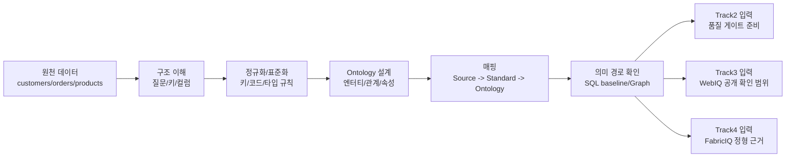

# Track1 One-Slide Executive Summary

## 제목
**Track1 FabricIQ 데이터 기반 구축: Ontology 중심 정형 데이터 준비 프레임**

## 한 줄 메시지
Track1은 단순 데이터 정리를 넘어서, Track2 품질 검증, Track3 WebIQ 범위 분리, Track4 FoundryIQ orchestration을 가능하게 하는 공통 의미 체계(Ontology)와 정형 데이터 기반을 확정한다.

## 아키텍처(발표용)

## 운영 정책 매트릭스

| 상황 | 시스템 동작 | 사용자 표시 | 기대 상태 |
|---|---|---|---|
| 정상(normal) | 표준화 + Ontology 매핑 + 의미 경로 확인 | 경로·baseline 표시 | READY |
| 스키마 불일치 | 표준 스키마 변환 규칙 적용 | 컬럼 변환 로그 표시 | READY/PARTIAL |
| 참조 무결성 실패 | 오류 레코드 분리 + 재검증 요청 | 누락 키 목록 표시 | PARTIAL |
| 코드값 표준 미준수 | 코드 딕셔너리 매핑/보정 | 비표준 코드 경고 | PARTIAL |
| 핵심 키 중복 다수 | 파이프라인 차단 + 수정 가이드 | 차단 원인 및 수정 단계 | BLOCKED |

## 기술 구현 포인트

1. **품질 개념 설명**: 결측/중복/무결성/이상값의 영향을 설명하되 참가자 탐지 실습에서는 제외
2. **표준 스키마 강제**: 키/타입/코드 규칙을 공통 규격으로 고정
3. **Ontology 모델 고정**: 엔터티(6~10), 관계(8~15), 카디널리티 명시
4. **매핑 추적성 확보**: source-to-ontology 매핑표를 산출물로 저장
5. **다음 트랙 인계 보장**: 매핑과 의미 경로 증적을 Track2/Track3/Track4 입력 아티팩트로 전달

## 발표용 결론

Track1의 핵심 산출물은 데이터셋 자체가 아니라, **정형 지표와 Ontology 관계 경로를 신뢰 가능하게 계산·검증할 수 있는 FabricIQ 기반 구조**이다.
