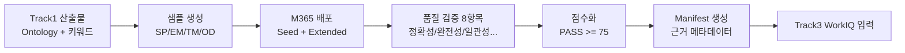

# Track2 One-Slide Executive Summary

## 제목
**Track2 WorkIQ 품질 게이트 검증: 업무 근거 데이터 품질·배포·재현 프레임**

## 한 줄 메시지
Track2는 Track1에서 준비된 구조를 실제 업무 근거 데이터로 확장해, 품질 게이트(8개 중 6개 PASS)와 배포 재현성을 검증하고 Track3의 WorkIQ 근거 소스를 안정화한다.

## 아키텍처(발표용)

## 운영 정책 매트릭스

| 상황 | 시스템 동작 | 사용자 표시 | 기대 상태 |
|---|---|---|---|
| 정상(normal) | 샘플 생성/배포/검증/manifest 완료 | 품질 점수 및 PASS 표시 | PASS |
| 일부 채널 배포 실패 | 실패 채널 재시도 + 부분 완료 기록 | 채널별 상태 표시 | PARTIAL |
| 품질 점수 미달(<75) | 미달 항목 재생성/재검증 루프 | FAIL 사유 및 조치안 | PARTIAL |
| ACL/권한 미적용 | 배포 중단 + 권한 점검 가이드 | 권한 오류 표시 | BLOCKED |
| manifest 누락/불일치 | Track3 인계 차단 + 재생성 | 인계 차단 경고 | BLOCKED |

## 기술 구현 포인트

1. **표준 분포 준수**: 시드 19건 + 확장 60업무항목(SP/EM/TM/OD) 유지
2. **원클릭 경로 제공**: generate -> execute 파이프라인으로 재현 가능성 확보
3. **품질 게이트 강제**: 8개 항목 중 6개 PASS(75점 이상) 조건 적용
4. **근거 추적 메타데이터**: manifest에 source/coverage/채널 정보 저장
5. **Track3 연결 보장**: WorkIQ 검색 가능한 구조와 키워드 일치성 검증

## 발표용 결론

Track2의 핵심 산출물은 샘플 데이터가 아니라, **권한이 적용된 업무 근거를 안정적으로 검색·검증·인계할 수 있는 WorkIQ 품질 운영 체계**이다.
