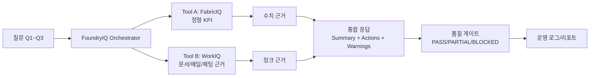

# Track3 One-Slide Executive Summary

## 제목
**Track3 FoundryIQ 운영형 에이전트 검증: FabricIQ + WorkIQ 통합 운영 프레임**

## 한 줄 메시지
Track3는 단순 답변 데모가 아니라, 정형/비정형 근거 결합, 장애 대응, 품질 게이트를 포함한 운영형 에이전트 실행 체계를 검증한다.

## 아키텍처(발표용)

## 운영 정책 매트릭스

| 상황 | 시스템 동작 | 사용자 표시 | 기대 상태 |
|---|---|---|---|
| 정상(normal) | Tool A/B 결합 응답 | 경고 없음 | PASS |
| Tool A 실패 | Tool B 근거 기반 제한 응답 | 정형 수치 미검증 | PARTIAL |
| Tool B 실패 | Tool A 수치 기반 제한 응답 | 업무 문서 근거 없음 | PARTIAL |
| Tool A/B 모두 실패 | 응답 생성 차단 + 복구 조치 | 차단 원인 및 재시도 안내 | BLOCKED |
| 일시 오류(429/5xx) | 초기 호출 + 5s -> 10s -> 20s 최대 3회 재시도 | 재시도 중 | 복구 시 PASS |

## 기술 구현 포인트

1. **재현 가능한 입력 생성**: Track1 CSV + Track2 manifest로 scenario/tool payload 자동 생성
2. **실패 주입 시뮬레이션**: normal, down, transient 모드로 운영 장애 재현
3. **응답 등급화**: pass/partial/blocked 정책을 코드로 강제
4. **감사 추적성**: runContext, retryPolicy, toolStatus를 결과 JSON에 저장
5. **자동 평가**: strict 모드에서 정책 불일치 시 즉시 fail

## 발표용 결론

Track3의 핵심 산출물은 "좋은 답변" 자체가 아니라, **실패를 포함한 운영 조건에서 일관되게 검증 가능한 에이전트 시스템**이다.
