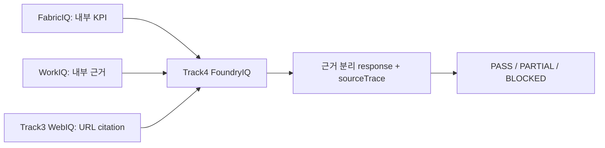

# Track4 FoundryIQ One-Slide Executive Summary

> The filename is a retained legacy Track3 FoundryIQ identifier. This is the active
> Track4 FoundryIQ slide source.

## 제목

**Track4 FoundryIQ 운영형 오케스트레이션: FabricIQ + WorkIQ + WebIQ 결합 검증**

## 한 줄 메시지

Track4는 수치, ACL 적용 업무 근거, 공개 웹 citation을 섞지 않고 장애·품질 게이트까지
검증하는 FoundryIQ orchestration 단계입니다.

| 상황 | 동작 |
| --- | --- |
| normal | 네 IQ trace와 분리된 근거 |
| Fabric/Work/Web 하나 실패 | 명시 경고 partial |
| Fabric+Work 실패 | public-web-only 분석 blocked |
| transient | 5초→10초→20초, 3회 재시도 |

결론: 좋은 문장보다 **출처 책임, 명시적 실패, 재현 가능한 평가**가 Track4의 산출물입니다.
